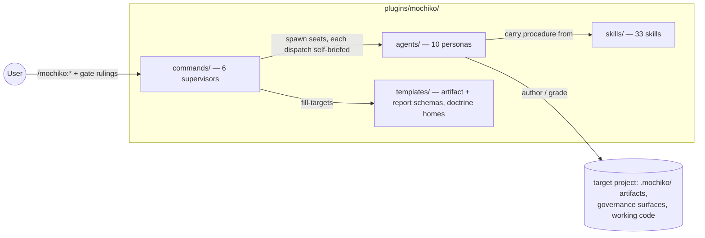
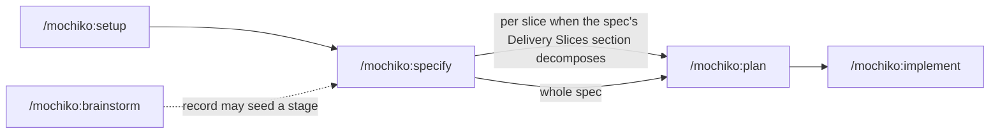
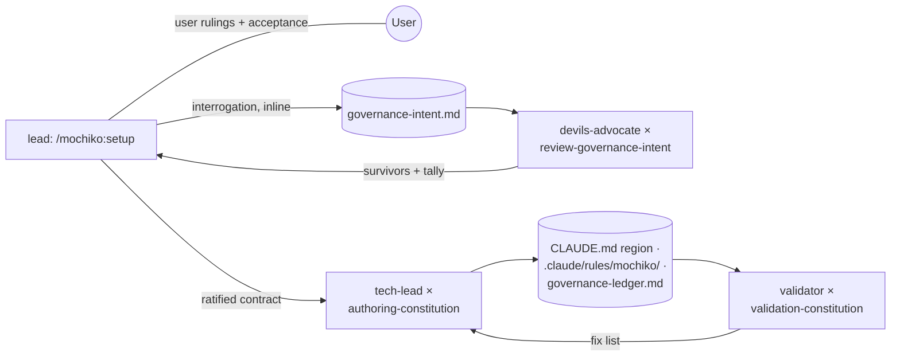
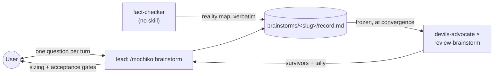
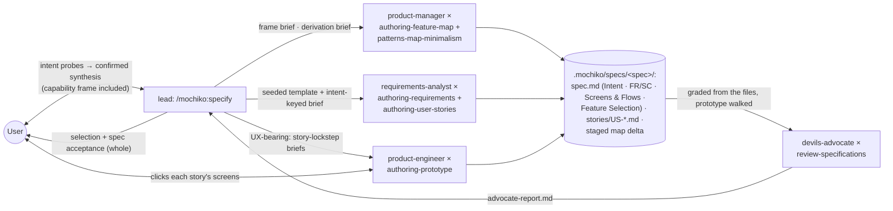
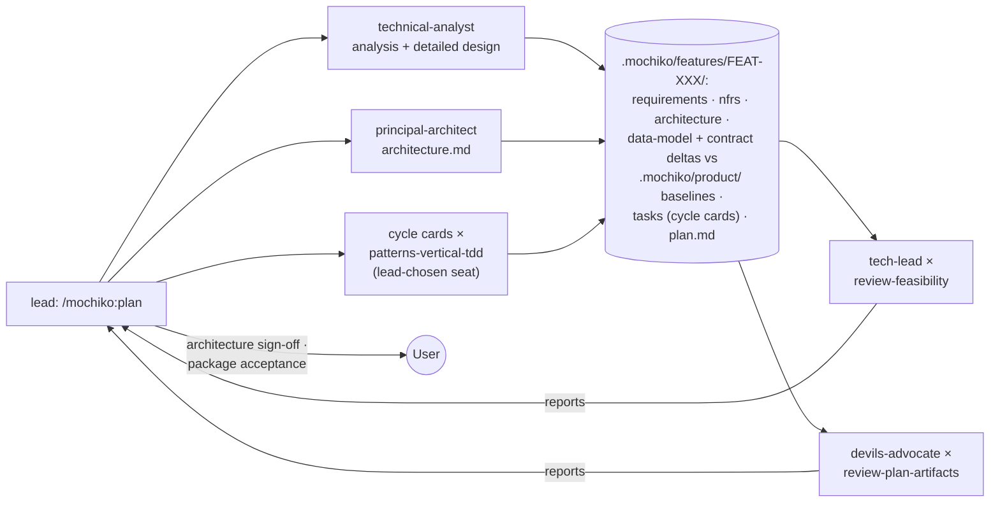
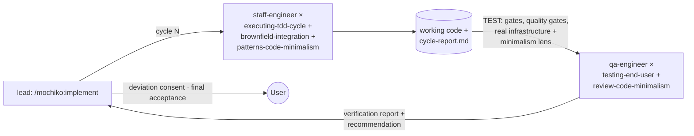

# Architecture — the mochiko plugin

Current-state map of the shipped plugin at [`plugins/mochiko/`](plugins/mochiko/) (v0.48.0,
[`plugin.json`](plugins/mochiko/.claude-plugin/plugin.json)). Scope is the plugin only — the
repo-side knowledge plane (`.mochiko/`, the operating docs) is covered by
[`CLAUDE.md`](CLAUDE.md). Rationale for every boundary here lives in the decisions layer
([`DECISIONS.md`](DECISIONS.md)); this doc records the resulting system. Maintained per
`mochiko:authoring-architecture`: updated at landings that change components, boundaries, or
data flow.

## System overview

Mochiko is a kernel-free Claude Code plugin: a product-delivery pipeline (governance → spec →
slices → plan → implementation) run entirely through native primitives — markdown command
supervisors, agent-team personas, and skills. There is no orchestration engine: each command
*is* the orchestrator for its workflow, and every command is a contract the lead composes a run
toward — a verifiable done-condition plus a non-waivable frame, in one of two anatomies (see
Command form) — with named decisions reserved to the user.

The pipeline the commands form (each stage user-gated; slicing rides inside specify; brainstorm's record
may seed any downstream stage — drawn at its typical hand-off, specify):

## Layer model

Four primitive layers compose every workflow. The composition conventions (the five axes) are
pinned in [`CLAUDE.md`](CLAUDE.md#skill-library-conventions-five-axes).

| Layer | Home | Count | Role |
|---|---|---|---|
| **Commands** | [`plugins/mochiko/commands/`](plugins/mochiko/commands/) | 6 | User-invoked contracts (`disable-model-invocation: true`) in two anatomies: `setup` / `specify` / `brainstorm` state Goal (default FAIL) · Harness (plan approval for producing seats · author ≠ grader independence · decisions reserved to the user) · Bindings (v8 rebuild, v0.48.0); `feature` / `plan` / `implement` are six-section **charters** — Delivery-Manager lead, the always-happens floor as owned responsibilities, the non-waivable floor in Boundaries (desk v0.68.0; pipeline pair v0.69.0). The lead plans and orchestrates the run — teammates or subagents per seat is its call. |
| **Agents** | [`plugins/mochiko/agents/`](plugins/mochiko/agents/) | 10 | Personas (all `model: opus`) that carry judgment and declare `skills:`. A persona contains no trace of any workflow — decoupling by absence; caller-side context rides the dispatch brief. |
| **Skills** | [`plugins/mochiko/skills/`](plugins/mochiko/skills/) | 33 | Procedure. One user-invoked router ([`skills/mochiko/`](plugins/mochiko/skills/mochiko/SKILL.md)) indexes the other 32, which are model-invoked with graded MUST/SHOULD triggers in their descriptions. Deterministic sub-checks ride as `scripts/` inside skills (e.g. `analysis-codebase`'s `detect-stack.sh`); depth rides as `references/`. |
| **Templates** | [`plugins/mochiko/templates/`](plugins/mochiko/templates/) | 14 + `constitution-modules/` | Two kinds: **artifact schemas** (spec — Intent + Delivery Slices sections included, plan, tasks as cycle cards, governance-intent, …) over the shared `artifact-format.md` envelope; **report schemas** (per-seat reports) over the shared `report-format.md` envelope. The former doctrine homes (`workflow-contract.md`, `agent-dispatch.md`, `sized-end-stage-review.md`) were deleted at the doctrine purge (v0.46.0–v0.47.0) — their mechanics live inline in each command. `constitution-modules/` is setup's module library (knowledge-management, layer-rules, release-gates, evolution-notes). |

The plugin manifest, [`.claude-plugin/plugin.json`](plugins/mochiko/.claude-plugin/plugin.json),
registers the command, agent, and skill directories and carries the version — packaging,
outside the four layers (templates is referenced by commands and skills, not registered).

### Boundaries between layers

- **Classification** — user-invoked primitives (the 6 commands, the router skill) may invoke
  model-invoked skills; never each other.
- **Persona ⟂ workflow** — workflow knowledge reaches an agent only through its dispatch brief
  (composed by the dispatching command) and mounted skills. Spawn prompts name skill + role
  explicitly, since teammates ignore `skills:` frontmatter.
- **Producer ≠ grader** — every reviewable artifact is graded by a structurally independent
  seat: different agent, different skill. A verification skill is never mounted on the seat it
  would grade.
- **Two review families** — the skill prefix encodes who owns the clearing:
  `validation-*` issues the authoritative binary PASS/FAIL (on the `validator` persona,
  default FAIL, human-gated downstream); `review-*` produces severity-ranked findings with a
  *recommended* status that the lead adjudicates — it never clears anything by itself.
- **Single-sourced homes** — the command shape, the report/artifact envelopes, and each
  cluster's contract live in exactly one file; commands and skills reference them at altitude
  (pointer depth, never restated).

### Command form (two anatomies)

Every command states a verifiable done-condition that defaults to FAIL, a frame — plan
approval before any producing seat works, author ≠ grader independence, the decisions
reserved to the user — and the homes the lead cannot invent (paths, templates, entry
conditions). Three commands (`setup`, `specify`, `brainstorm`) carry it as the v8 **goal +
harness** anatomy — Goal · Harness · Bindings (v8 rebuild, v0.48.0; task layer
de-granularized + slice absorbed into specify, v0.49.0). Three (`feature`, `plan`,
`implement`) carry it as six-section **charters** — Identity & Mission · Adaptive Goal
Protocol · Roles & Responsibilities · Tools · Ways of Working · Boundaries — with the
always-happens floor as the Delivery Manager's owned responsibilities and the non-waivable
floor in Boundaries (the desk at v0.68.0, D10; the pipeline pair at v0.69.0, ADR
`2026-08-13-charter-plan-implement`). The lead plans and orchestrates the run within that
frame; teammates vs subagents is its per-seat call. There is no run registry and no daemon;
commands evolve independently.

## Cluster map

Each workflow is one command plus its seats — the team roles it spawns, each an agent × the
skills briefed onto it. Full when-to-reach guidance and the
per-skill index live in the router ([`skills/mochiko/SKILL.md`](plugins/mochiko/skills/mochiko/SKILL.md));
this map records the wiring.

### Setup — governance from interrogated intent

[`commands/setup.md`](plugins/mochiko/commands/setup.md). The lead interrogates the user's
intent inline (ten dimensions via `analysis-iterative`, then the catalog deck), a sized cold
review stress-tests the synthesis before the user ratifies it, then a producer↔validator loop
authors and grades the governance surface set — there is no `constitution.md`.

| Seat | Wiring |
|---|---|
| producer | `tech-lead` × `analysis-codebase` (brownfield), `authoring-constitution` |
| intent reviewer(s) | `devils-advocate` × `review-governance-intent` — sized pair / single / waiver |
| validator | `validator` × `validation-constitution` — binary PASS/FAIL from the files |

Optional post-acceptance probe: `testing-governance-injection` empirically verifies the rules
inject. `grooming-operating-docs` fires at command boundaries when a knowledge-management
cap or bound trips.

### Brainstorm — think together, review cold

[`commands/brainstorm.md`](plugins/mochiko/commands/brainstorm.md). The session is the lead and
the user (questioning inline via `analysis-iterative`), plus a fact-checker teammate — a
neutral, skill-less seat filled only when the topic has a reality surface — whose map lands
verbatim in the record. At convergence the user sizes a cold review at a named gate.

| Seat | Wiring |
|---|---|
| fact-checker | neutral empiricist, no skill mounted — conditional on a reality surface |
| reviewer(s) | `devils-advocate` × `review-brainstorm` — sized pair (decision-quality / record-integrity lenses) / single / waiver |

Deliverable: one decision record (a fidelity-checked `synthesis.md` on request). Pipeline entry
is an offer, never a default.

### Specify — feature specification

[`commands/specify.md`](plugins/mochiko/commands/specify.md). An **intent stage** opens the
run — an adaptive-probe agenda (`analysis-iterative`: scope · delivery · depth-rigor ·
UX-bearing · constraints · out-of-scope) with the capability map an obligated read, closing
in a one-screen synthesis the user confirms; within it the `product-manager` seat states the
**capability frame** — which capabilities the territory touches, extend-vs-mint — as a
nouns-and-verbs hypothesis that never enumerates stories. Stories are then authored inside
that frame (a hypothesis, not an anchor: stories win any conflict, resolved at the
post-stories confirm step). After stories the PM confirms or adjusts the frame, **cuts the
work rows** grouped per capability, and runs the story filter (rejections recorded, never
silent); the user rules the **selection** — which work rows build now — with the
per-capability completeness view (pending rows · stubs · kills) visible at the moment of
choice. The staged map delta executes as one atomic batch at spec acceptance. A UX-bearing
spec carries a **Screens & Flows** section — the SCR/FLOW manifest plus a clickable low-fi
prototype under `prototype/` (`product-engineer` × `authoring-prototype`), authored in story
lockstep, the user clicking each story's screens as they land; not UX-bearing takes the
waiver line.

| Seat | Wiring |
|---|---|
| producer | `requirements-analyst` × `authoring-requirements`, `authoring-user-stories` — stories and FR/SC authored inside the PM's frame |
| product manager | `product-manager` × `authoring-feature-map` (+ `patterns-map-minimalism` discipline) — capability frame at intent · confirm + work-row cutting + filter after stories · selection card |
| prototype producer (UX-bearing) | `product-engineer` × `authoring-prototype` (Screens & Flows manifest + `prototype/` app, story lockstep with the analyst) |
| critic | `devils-advocate` × `review-specifications` (capability/work-row derivation + map-delta grade, Screens & Flows prototype walk included) |

### Plan — implementation package, architecture first

[`commands/plan.md`](plugins/mochiko/commands/plan.md). Four producer stages (analysis →
architecture → detailed design → structuring) under two reviewer lenses. The architecture is
the first design artifact and stops the run at a rendered-diagram sign-off before
anything is designed against it.

| Seat | Wiring |
|---|---|
| producer | `technical-analyst` × `authoring-technical-requirements`, `patterns-technical-decisions`, `patterns-entity-modeling`, `patterns-api-contracts` |
| architect | `principal-architect` × `patterns-system-design` — authors `architecture.md` + structural D-XXX rows when the proposal includes architecture; also files the proposal contest brief (the persona also declares `patterns-technical-decisions`) |
| cycle-card producer | `patterns-vertical-tdd` on a seat of the lead's choosing — `tasks.md` as cycle cards (no fixed persona) |
| feasibility | `tech-lead` × `review-feasibility` — analysis, the class-7 excess/altitude hunt, then the architecture pass |
| completeness | `devils-advocate` × `review-plan-artifacts` (cycle cards included) |
| architecture scribe | `principal-architect` × `authoring-architecture` — disposable, at finalize; records the initial `ARCHITECTURE.md` baseline when the target repo has none |

Case distinguishes two artifacts here: lowercase `architecture.md` is the per-capability design
artifact under `.mochiko/features/FEAT-XXX/`; uppercase `ARCHITECTURE.md` is a repo's living
system map (the class of doc this file is), folded at landings by the scribe seats.

The architecture scribe runs at finalize, outside the round loop, and is omitted from the
diagram. The run unit is the **capability-batch** — one capability plus exactly its selected
work rows (a `/mochiko:feature` delta card collapses the run to confirming the card); batches
order by the rows' dependency closure, and design deltas land against the `.mochiko/product/`
baselines.

### Implement — execute the cycle cards

[`commands/implement.md`](plugins/mochiko/commands/implement.md). Cycle-by-cycle (foundation
before feature), each card decomposed by its builder at build time (disclosed in the cycle
report), implemented through red/green/refactor, and independently verified
against real infrastructure. The per-cycle checkpoint carries the shape's only devolved branch:
a cycle whose verifications are all deterministic CLI checks at 100% pass, with no reported
deviation and no new domain dependencies (`domain_deps_added` empty), clears on the verifier's
evidence without a lead read — anything else fires the human-adjudicated checkpoint.

| Seat | Wiring |
|---|---|
| producer | `staff-engineer` × `executing-tdd-cycle`, `brownfield-integration`, `patterns-code-minimalism` (the pre-code ladder at decomposition, rungs disclosed) |
| verifier | `qa-engineer` × `testing-end-user`, `review-code-minimalism` (advisory `minimalism:` findings; reads diff + cycle report + codebase) — never mounted on the producer |
| arch-diff | `principal-architect` × `authoring-architecture` — disposable, built-vs-approved at final validation |
| arch-scribe | `principal-architect` × `authoring-architecture` — disposable, folds built structure into `ARCHITECTURE.md` |

The approved `architecture.md` is briefed input, guarded twice: the producer's diagram-anchored
deviation self-check at cycle open/close, and the arch-diff seat's built-vs-approved report at
final validation. The two disposable seats (arch-diff at final validation, arch-scribe at
finalize) run outside the cycle loop and are omitted from the diagram. The acceptance landing
executes the graduation whole: delivered work rows fold into the capability's extent (pending
rows persist), every touched product baseline takes its graded delta fold, and the map
bookkeeping (index line · In-flight pointer · specs-index row) lands in the same moment — no
separate feature-close stage exists.

### Feature — the product desk

[`commands/feature.md`](plugins/mochiko/commands/feature.md). The first of the library's three
**charter-form** commands (`plan.md` and `implement.md` joined at v0.69.0) — six sections
(Identity & Mission · Adaptive Goal Protocol · Roles & Responsibilities · Tools · Ways of
Working · Boundaries); its audit re-keys to *floor present + per-visit goal contract
present*. The lead is chartered **Delivery Manager of the product
desk**: the advisory front door to the capability map. A visit opens with the map-health
report (stale stubs · unfolded deltas · cap pressure · a what-next line), converges to a
one-line goal with an explicit done condition, then routes the demand by the
**capability-write test** — capability writes (mint · merge · retire · status) are sacred to
`/mochiko:specify` or a user grooming ruling; work rows are delivery bookkeeping the desk may
cut through the **growth door** (extend-verdict only; several rows, a new UX surface, or
cross-capability reach route to specify regardless). Growth rows dispatch in selection scope,
bug/improvement delta cards in delta scope; the desk runs no delivery harness. The
`product-manager` seat carries extend-vs-mint and cap-trip grooming proposals;
`principal-architect` co-signs domains, dormant until the first cap-trip.

### Shared seats

Several personas serve multiple clusters — the reuse axis of the agent layer:
`devils-advocate` reviews in four (specify, plan, brainstorm, setup); `tech-lead` authors
governance in setup and reviews feasibility in plan; `principal-architect` authors the
architecture (and its contest brief) in plan, scribes/diffs `ARCHITECTURE.md` at plan and
implement landings, and co-signs domains at the desk (dormant until the first cap-trip);
`product-manager` frames and derives in specify and carries the desk's grooming proposals;
`validator` grades setup's surfaces (and any artifact handed to it with an explicit
checklist). The cycle-card craft (`patterns-vertical-tdd`) is seatless — lead-dispatched to
whichever producer seat fits the run.

## Cross-cutting doctrine

| Primitive | Carries |
|---|---|
| `report-format.md` / `artifact-format.md` (templates) | The two shared envelopes every report and pipeline artifact follows. |
| `analysis-iterative` (skill) | The shared questioning engine — lead-inline in brainstorm, setup's interrogation, and specify's intent stage. |
| `grooming-operating-docs` (skill) | Fix-on-sight restoration of a target project's operating docs when a pinned knowledge-management cap trips at a command boundary. |

## Data flow — what lands where

The plugin ships no state and integrates with no external services — every read and write is
the **target project's** workspace:

- **Governance surfaces** — a marked region in the target's `CLAUDE.md`,
  `.claude/rules/mochiko/*.md`, skill pointers; setup-owned and idempotently regenerated.
- **`.mochiko/memory/`** — `governance-intent.md`, `governance-ledger.md`,
  `codebase-analysis.md` (brownfield), and the project-pinned `knowledge-management.md` every
  command resolves at runtime for its KM landing.
- **`FEATURES.md` + `.mochiko/features/`** — the capability map: the index, per-capability
  entry files (work rows riding the entries, pending|live), and per-capability run dirs
  (`FEAT-XXX/`: the plan package, `tasks.md` cycle cards, per-seat reports).
- **`.mochiko/product/`** — the five product baselines (`data-model.md` · `contracts/` ·
  `nfrs.md` · `constraints-and-decisions.md` · `quickstart.md`) that per-capability deltas
  fold into at acceptance landings.
- **`.mochiko/specs/<spec>/`** — the delivery-event record: `spec.md` (Intent + Feature
  Selection), `stories/US-*.md`, the staged map delta until acceptance.
- **`.mochiko/brainstorms/<slug>/`** — `record.md` (+ optional `synthesis.md`) and the session
  index.
- **The working tree** — implement's deliverable is the code itself; `tasks.md`'s per-card
  checkboxes are the progress ledger.
- **Kill-switches** — per-run stop files (`SETUP_STOP`, `SPECIFY_STOP`, `PLAN_STOP`,
  `IMPLEMENT_STOP`) checked before every seat send.

Recovery is workspace-as-state everywhere: each command's Recovery table maps artifact evidence
to a resume stage, so an interrupted run continues without any registry.
