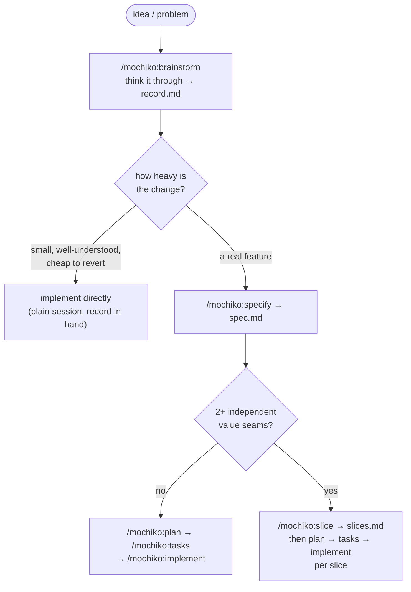
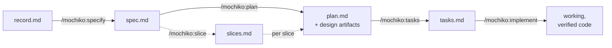
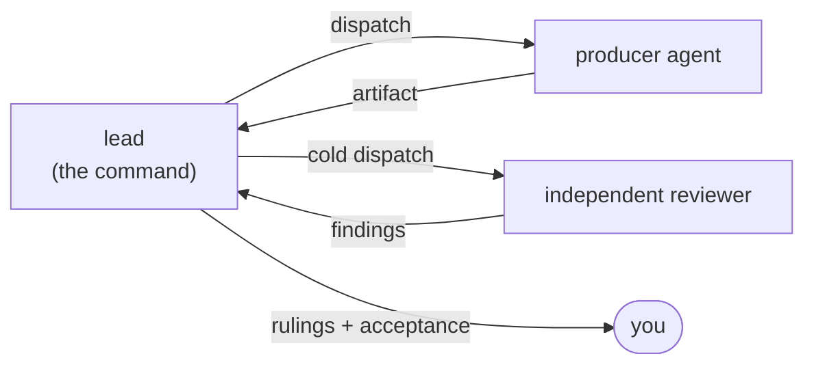

# Mochiko

Kernel-free agent-skill framework for Claude Code: sound-loop workflows built from native agent teams and skills.

Mochiko is the successor to human-in-loop. The bet: engineering discipline lives in the quality of the skill library, not in a deterministic kernel. Every workflow is a **sound loop** — a producer agent authors, an independent reviewer grades (never the author), and **you** are the final validator at named human gates.

## Install

```
/plugin marketplace add humaninloop-dev/mochiko
/plugin install mochiko@mochiko
```

`/mochiko:brainstorm` and `/mochiko:setup` run on native agent teams — they require `CLAUDE_CODE_EXPERIMENTAL_AGENT_TEAMS=1` and refuse without it.

Once per project, establish governance with `/mochiko:setup` — it interrogates your intent (tier, type, risk, values), you ratify a synthesis, then it lands enforceable principles on native surfaces (a CLAUDE.md governance region, path-scoped rules files, a governance ledger). Everything downstream inherits it automatically.

## Choose your path

Every path starts by thinking, not typing. `/mochiko:brainstorm` walks the problem through with you one question at a time — a fact-checker teammate verifies claims against your files as you go — and leaves a cold-reviewed decision record behind. What happens next is proportional to the change: enter the pipeline when it pays, bypass it when it doesn't. Brainstorm itself never pushes — *pipeline entry is an offer, never a default*.



| Path | Take it when | Example |
|---|---|---|
| **Brainstorm → implement** (bypass the pipeline) | One decision surface; you could hold the whole diff in your head; a wrong call is cheap to revert; the accepted record already reads like an implementation brief | Choosing a caching strategy and applying it; adding a CLI flag; a contained refactor |
| **Full pipeline** (whole spec) | A real feature: several requirements, unknowns worth adversarial review, brownfield risk — but one coherent unit of value | A new API endpoint set with a data-model change, shipped as a unit |
| **Sliced pipeline** (per slice) | The spec has 2+ independent value seams and you want working code per increment instead of one big landing | Auth + profile + audit trail — each usable on its own |

Tie-breaker: if the accepted record reads like a feature description, run `/mochiko:specify` with it. If it reads like a to-do list, just build it.

## The quick path: brainstorm → implement

1. `/mochiko:brainstorm <topic>` — the lead questions, you decide; every ruling lands in `.mochiko/brainstorms/<slug>/record.md` with a confidence mark. At convergence **you size the review**: a lens-split cold reviewer pair (default for heavyweight records), a single reviewer, or a recorded waiver. Only surviving findings reach you for rulings; then you accept the record.
2. Implement in a plain session with the record as the brief: *"implement D1–D4 from `.mochiko/brainstorms/<slug>/record.md`"*. The record is built to stand alone — standalone fitness is part of what the reviewers grade.
3. Guardrail: if implementation starts sprouting requirements questions mid-flight, you bypassed too far — stop and run `/mochiko:specify` with the record as input. Nothing is lost; the record is exactly what specify wants.

## The pipeline: specify → (slice) → plan → tasks → implement

Each stage is its own command, converges on one reviewed artifact under `.mochiko/specs/<feature>/`, and ends at a human acceptance gate. Stop at any stage — the artifact is the interface.



`/mochiko:slice` is the optional branch: it groups the spec's stories into **graduation slices** that run plan → tasks → implement independently, foundation slice first. It has a null exit — a spec without two distinct value seams gets a reviewed whole-spec recommendation, never a forced decomposition.

## Every workflow is a sound loop



Four rules, no exceptions: a done-condition declared before the loop runs (defaulting to FAIL) · the producer never grades its own output · bounded iteration with an escalation path · a named human gate. The human is the framework's primary external validator — that's what the human-in-loop lineage means here.

## Commands

| Command | Produces | Loop |
|---|---|---|
| `/mochiko:setup` | Governance surface set (CLAUDE.md region, rules files, ledger) | interrogation → ratified intent → author ↔ validate |
| `/mochiko:brainstorm` | `record.md` decision record | you + lead think; sized cold review at convergence |
| `/mochiko:specify` | `spec.md` | requirements-analyst ↔ devils-advocate |
| `/mochiko:slice` | `slices.md` overlay | task-architect ↔ devils-advocate |
| `/mochiko:plan` | `plan.md` + analysis/design artifacts | technical-analyst ↔ completeness + feasibility reviewers |
| `/mochiko:tasks` | `task-mapping.md` + `tasks.md` | task-architect ↔ devils-advocate |
| `/mochiko:implement` | Working, verified code | staff-engineer ↔ qa-engineer, cycle by cycle |

## Going deeper

- The `mochiko` router skill indexes every skill, agent, and command with when-to-reach-each guidance.
- [`ROADMAP.md`](ROADMAP.md) — the thesis and every key decision, with rationale.
- [`REGISTRY.md`](REGISTRY.md) — the primitive inventory.
- [`BACKLOG.md`](BACKLOG.md) — open design questions.
