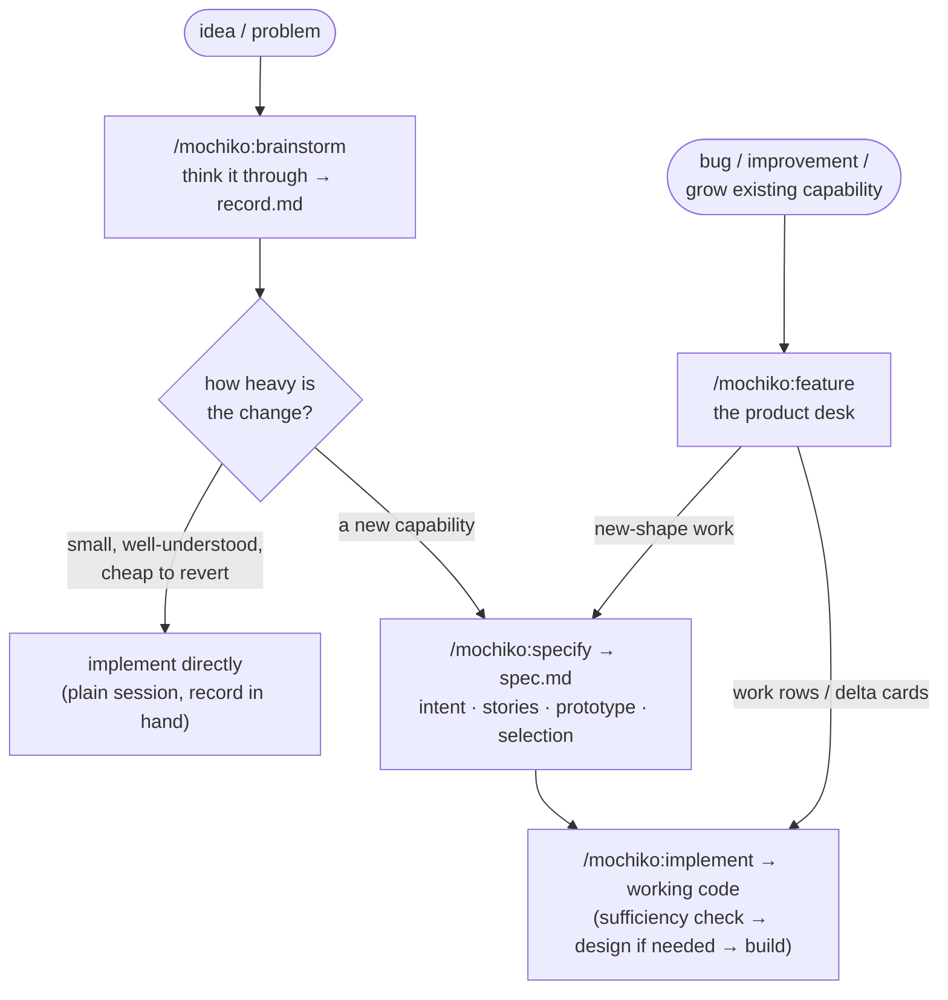
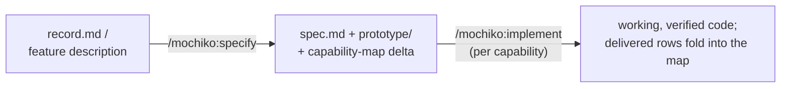
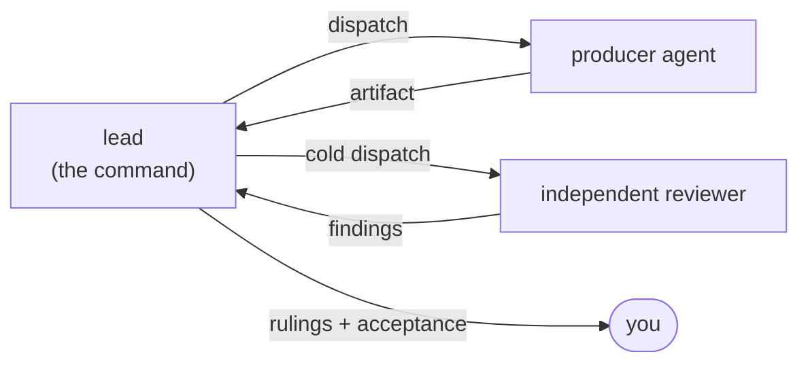

# Mochiko

Skills-first agent framework for Claude Code: sound-loop workflows built from native agents and skills, their rules delivered at fire by a small CLI.

Mochiko is the successor to human-in-loop. The bet: engineering discipline lives in the quality of the skill library, not in a deterministic kernel. Every command states its whole contract up front, and all six — `architecture`, `brainstorm`, `feature`, `implement`, `setup`, `specify` — follow **one canonical scaffold**: an identity and mission, the command's own rule set in front of the model before any work begins, and an adaptive goal protocol that names the finish line before work starts and defaults to FAIL until it is met, over a non-waivable floor. The lead plans and orchestrates the run natively, choosing teammates or subagents per seat. Every workflow is a **sound loop**: a producer authors, an independent reviewer grades (never the author), and **you** are the final validator at named human gates.

## Install

Two steps. Both are required.

**1. The plugin.** A plain marketplace clone — no build step, nothing fetched beyond the clone.

```
/plugin marketplace add humaninloop-dev/mochiko
/plugin install mochiko@mochiko
```

**2. The `mochiko-cli` binary.** From this version the plugin **depends** on it: every command's
and skill's rules are rendered at fire by the binary, and a command or skill **halts** when it is
missing rather than falling back to anything. The plugin never ships it — you install it once, as
you would any other developer tool. A Rust toolchain is required, and until the first crates.io
release the install is straight from GitHub:

```
cargo install --git https://github.com/humaninloop-dev/mochiko mochiko-cli
```

A session-start hook reports the binary's presence, its version, and whether the plugin's
migration log is inside the version range it reads, so a missing or skewed install is loud before
your first command rather than at the end of one.

Once per project, establish governance with `/mochiko:setup` — it interrogates your intent (type, risk, values), you ratify a synthesis, then it lands enforceable principles on the surfaces Claude Code natively loads (a CLAUDE.md governance region, path-scoped rules files, a governance ledger). Everything downstream inherits it automatically.

### What `mochiko-cli` serves

The plugin carries a **migration log** at `plugins/mochiko/migrations/` — an append-only record of every rule and template the library ships. The binary replays that log in memory at fire and renders what the moment needs. The log is the source of truth; the rendered view is produced fresh each time and never edited by hand. **The plugin ships no schema file at all**: the log is the only rule data it carries, so there is nothing a command could read instead of asking the binary.

```
mochiko-cli rules <primitive> --section <id>   # one section of a command's or skill's rules
mochiko-cli template <name>                    # producer view: schema + example + good/bad guidance
mochiko-cli template <name> --check            # checklist view: one check line per section
mochiko-cli doc <name>                         # a shelf or label-registry document
mochiko-cli migrate status --plugin-root <plugin>     # the log's grammar, its sequences, the replayed state
mochiko-cli migrate validate --plugin-root <plugin>   # replay the log and report what the hard set found
```

A rules render is one section at a time. Each block opens with a version triple — binary version, log grammar version, plugin version — and closes with an end line carrying the section's rule count. A command proceeds only when both lines arrive in that exact shape, and halts on anything else.

`template <name>` takes one of `spec`, `tasks`, `feature-entry`, `features-index`, `codebase-analysis`, `governance-intent`, `governance-surfaces`, `architecture-store`. The `--check` view is a guidance view, never a linter — it takes no artifact input and always exits 0 on success. `doc <name>` serves the non-template documents — the backend shelf `architecture-shelf-backend` and the two label registries `command-labels` and `skill-labels`.

The log directory resolves `--log-dir <path>` → `--plugin-root <root>/migrations` → `MOCHIKO_MIGRATIONS` → `./migrations`. Commands and hooks pass `--plugin-root` so they always read the log inside the installed plugin.

Working from a checkout of this repo rather than a release, `cargo install --path crates/mochiko-cli` builds the maintainer's copy. That is a maintainer path, not a second user install route.

## The capability map

The product's capability layer lives in a repo-level map: `FEATURES.md` plus one FEAT-XXX entry per capability. Capabilities are durable — what the product *does*; **work rows** are transient — what it is currently building, attached to a capability and folded into its extent when delivered. A `product-manager` seat stewards the map and recommends; capability writes (mint, merge, retire) happen only inside `/mochiko:specify` or by your grooming ruling, and selection — which rows build now — is always yours.

## Choose your path

Every path starts by thinking, not typing. `/mochiko:brainstorm` walks the problem through with you one question at a time and leaves a cold-reviewed decision record behind. What happens next is proportional to the change: enter the pipeline when it pays, bypass it when it doesn't. Brainstorm itself never pushes — *pipeline entry is an offer, never a default*.


```mermaid
flowchart TD
    idea(["idea / problem"]) --> bs["/mochiko:brainstorm<br/>think it through → record.md"]
    demand(["bug / improvement /<br/>grow existing capability"]) --> desk["/mochiko:feature<br/>the product desk"]
    bs --> gate{"how heavy is<br/>the change?"}
    gate -->|"small, well-understood,<br/>cheap to revert"| direct["implement directly<br/>(plain session, record in hand)"]
    gate -->|"a new capability"| spec["/mochiko:specify → spec.md<br/>intent · stories · prototype · selection"]
    desk -->|"new-shape work"| spec
    spec --> impl["/mochiko:implement → working code<br/>(sufficiency check → design if needed → build)"]
    desk -->|"work rows / delta cards"| impl
```

| Path | Take it when | Example |
|---|---|---|
| **Brainstorm → implement** (bypass the pipeline) | One decision surface; you could hold the whole diff in your head; a wrong call is cheap to revert; the accepted record already reads like an implementation brief | Choosing a caching strategy and applying it; adding a CLI flag; a contained refactor |
| **Product desk** (`/mochiko:feature`) | A bug, an improvement, or growth of a capability the map already carries — or you're not sure where a demand belongs. Each visit opens with a map-health report, converges to a one-line goal with an explicit done condition, and routes the demand; growth work rows and bug/improvement delta cards dispatch straight to the pipeline | Fixing a pagination bug; adding an export format to an existing reporting capability |
| **Pipeline** (`/mochiko:specify` onward) | New-shape capability work: several requirements, unknowns worth adversarial review, brownfield risk. Specify cuts the work into rows grouped per capability; you select what builds now; implement then runs once per capability | A new API endpoint set with a data-model change |

Tie-breaker: if the accepted record reads like a feature description, run `/mochiko:specify` with it. If it names a capability the map already carries, take it to `/mochiko:feature`. If it reads like a to-do list, just build it.

## The quick path: brainstorm → implement

1. `/mochiko:brainstorm <topic>` — the lead questions, you decide; every ruling lands in `.mochiko/brainstorms/<slug>/record.md` with a confidence mark. At convergence the record is cold-reviewed (or your waiver is recorded on it); only surviving findings reach you for rulings; then you accept the record.
2. Implement in a plain session with the record as the brief: *"implement D1–D4 from `.mochiko/brainstorms/<slug>/record.md`"*. The record is built to stand alone — standalone fitness is part of what the reviewer grades.
3. Guardrail: if implementation starts sprouting requirements questions mid-flight, you bypassed too far — stop and run `/mochiko:specify` with the record as input. Nothing is lost; the record is exactly what specify wants.

## The pipeline: specify → implement

Each stage is its own command, converges on reviewed artifacts, and ends at a human acceptance gate. Stop at any stage — the artifact is the interface.


```mermaid
flowchart LR
    R["record.md /<br/>feature description"] -- "/mochiko:specify" --> S["spec.md + prototype/<br/>+ capability-map delta"]
    S -- "/mochiko:implement<br/>(per capability)" --> C["working, verified code;<br/>delivered rows fold into the map"]
```

**`/mochiko:specify`** opens with an intent stage — scope, delivery, depth, constraints, out-of-scope, the capability map an obligated read — where the product-manager seat states a **capability frame**: which capabilities the work touches, extend vs mint, as a hypothesis the stories may overturn. You confirm the synthesis before anything is authored. The spec that lands carries prioritized user stories, testable requirements, measurable success criteria, and two sections:

- **Screens & Flows** — when the feature has a user-facing surface, a clickable low-fi HTML prototype is built *with* the stories: you click each story's screens while the story is still being shaped. Flows are binding on the design; pixels stay deliberately rough.
- **Feature Selection** — after stories, the PM confirms the frame, cuts **work rows** grouped per capability, and runs the story filter (rejections recorded, never silent). You rule the selection — which rows build now — with each capability's completeness view in front of you. The map delta lands as one atomic batch at spec acceptance.

**`/mochiko:implement`** runs once per capability and its selected work rows. It opens with a **sufficiency check**: an independent seat grades, work row by work row, whether the spec, the architecture store, and the product baselines already carry enough for a builder to build it — testable criteria, named contract and data surfaces, structural triggers, NFR targets, commodity decisions, dependency order, the screen-to-contract trace, and any collision with delivered or in-flight work. The verdict is binding and lands as a durable report; a disputed clause defaults to a gap and comes to you.

What happens next depends on that verdict. **Zero gaps** goes straight to card authoring and build. **Any gap** fires an **in-run design phase scoped to exactly those gaps and nothing else** — data-model and API-contract deltas against the shared `.mochiko/product/` baselines, and an architecture-store delta **you sign at a blocking checkpoint before any code is written**. A seat that did not author the design grades it. Then `tasks.md` lands as cycle cards — stories, dependencies, acceptance criteria, and a real-infrastructure `TEST:` gate per card — authored by a design seat, never by the builder who will execute them, and confirmed by you at their own checkpoint.

Build then executes the cards test-first (red/green/refactor), foundation cycles before feature cycles. The builder decomposes each card into concrete tasks at build time. Implementation and verification are never the same seat; verification runs against real infrastructure with captured evidence, and the final validation runs from a dependency-cold snapshot. A builder who hits undesigned structure mid-cycle stops, and the design phase re-fires for exactly that discovery. Any deviation from the signed store delta stops and comes back to you. Your acceptance is the landing: delivered work rows fold into the capability's extent and touched baselines take their delta folds — no separate feature-close stage.

> `/mochiko:plan` was retired at v0.91.0. Planning was not deprecated — it moved inside implement, behind the sufficiency check, so design work happens when a batch actually needs it instead of as a fixed stage. Rationale: [`.mochiko/brainstorms/plan-stage-utility/record.md`](.mochiko/brainstorms/plan-stage-utility/record.md).

## Every workflow is a sound loop


```mermaid
flowchart LR
    L["lead<br/>(the command)"] -->|dispatch| P["producer agent"]
    P -->|artifact| L
    L -->|"cold dispatch"| V["independent reviewer"]
    V -->|findings| L
    L -->|"rulings + acceptance"| H(["you"])
```

Four rules, no exceptions: a done-condition declared before the loop runs (defaulting to FAIL) · the producer never grades its own output · bounded iteration with an escalation path · a named human gate. The human is the framework's primary external validator — that's what the human-in-loop lineage means here.

## Commands

| Command | Produces | Loop |
|---|---|---|
| `/mochiko:setup` | Governance surface set (CLAUDE.md region, rules files, ledger) | interrogation → ratified intent → author ↔ independent grade |
| `/mochiko:brainstorm` | `record.md` decision record | you + lead think; cold review at convergence |
| `/mochiko:feature` | Map-health report, routed demands, work rows / delta cards dispatched to the pipeline | Delivery-Manager desk; every visit converges to an explicit done condition |
| `/mochiko:specify` | `spec.md` (intent · stories · Screens & Flows · Feature Selection) + `prototype/` + the capability-map delta | intent stage → product-manager frames, requirements-analyst + product-engineer author ↔ devils-advocate |
| `/mochiko:architecture` | The product architecture store at `.mochiko/product/architecture/` — baseline, per-row stances, amendments, drift dispositions | health view → one-line visit goal → principal-architect authors ↔ tech-lead grades ↔ you rule every stance |
| `/mochiko:implement` | Working, verified code; design artifacts at `.mochiko/features/FEAT-XXX/` where the batch needed them; the acceptance landing folds delivered rows into the map | sufficiency check → conditional design phase (author ↔ independent grade ↔ your sign-off) → card confirm → staff-engineer ↔ qa-engineer, cycle by cycle |

## Going deeper

- The `mochiko` router skill indexes every skill, agent, and command with when-to-reach-each guidance.
- The plugin ships two optional output styles — **Caveman** and **Caveman BLUF** — selectable via `/config` → Output style; they restyle the conversation only, never workflow reports or artifacts.
- [`ARCHITECTURE.md`](ARCHITECTURE.md) — how the library composes: commands, seats, data flow.
- [`ROADMAP.md`](ROADMAP.md) — the thesis, current work, and standing bets.
- [`DECISIONS.md`](DECISIONS.md) — the ruled-decision index.
- [`BACKLOG.md`](BACKLOG.md) — open design questions.
