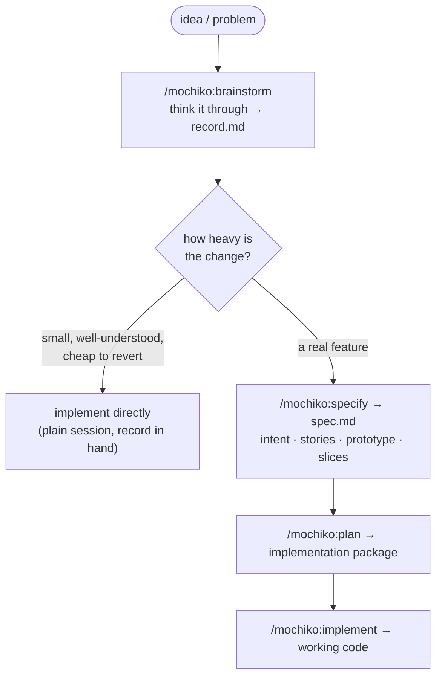
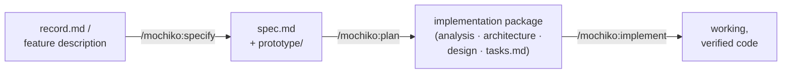

# Mochiko

Kernel-free agent-skill framework for Claude Code: sound-loop workflows built from native agents and skills.

Mochiko is the successor to human-in-loop. The bet: engineering discipline lives in the quality of the skill library, not in a deterministic kernel. Every command is **goal + harness** — a verifiable done-condition (default FAIL) plus a non-waivable frame — and the lead plans and orchestrates the run natively, choosing teammates or subagents per seat. Every workflow is a **sound loop**: a producer authors, an independent reviewer grades (never the author), and **you** are the final validator at named human gates.

## Install

```
/plugin marketplace add humaninloop-dev/mochiko
/plugin install mochiko@mochiko
```

Once per project, establish governance with `/mochiko:setup` — it interrogates your intent (type, risk, values), you ratify a synthesis, then it lands enforceable principles on the surfaces Claude Code natively loads (a CLAUDE.md governance region, path-scoped rules files, a governance ledger). Everything downstream inherits it automatically.

## Choose your path

Every path starts by thinking, not typing. `/mochiko:brainstorm` walks the problem through with you one question at a time and leaves a cold-reviewed decision record behind. What happens next is proportional to the change: enter the pipeline when it pays, bypass it when it doesn't. Brainstorm itself never pushes — *pipeline entry is an offer, never a default*.


```mermaid
flowchart TD
    idea(["idea / problem"]) --> bs["/mochiko:brainstorm<br/>think it through → record.md"]
    bs --> gate{"how heavy is<br/>the change?"}
    gate -->|"small, well-understood,<br/>cheap to revert"| direct["implement directly<br/>(plain session, record in hand)"]
    gate -->|"a real feature"| spec["/mochiko:specify → spec.md<br/>intent · stories · prototype · slices"]
    spec --> plan["/mochiko:plan → implementation package"]
    plan --> impl["/mochiko:implement → working code"]
```

| Path | Take it when | Example |
|---|---|---|
| **Brainstorm → implement** (bypass the pipeline) | One decision surface; you could hold the whole diff in your head; a wrong call is cheap to revert; the accepted record already reads like an implementation brief | Choosing a caching strategy and applying it; adding a CLI flag; a contained refactor |
| **Pipeline, single slice** | A real feature: several requirements, unknowns worth adversarial review, brownfield risk — but one coherent unit of value | A new API endpoint set with a data-model change, shipped as a unit |
| **Pipeline, sliced** | The spec has 2+ independent value seams and you want working code per increment instead of one big landing — slicing is decided inside `/mochiko:specify`, not a separate command | Auth + profile + audit trail — each usable on its own |

Tie-breaker: if the accepted record reads like a feature description, run `/mochiko:specify` with it. If it reads like a to-do list, just build it.

## The quick path: brainstorm → implement

1. `/mochiko:brainstorm <topic>` — the lead questions, you decide; every ruling lands in `.mochiko/brainstorms/<slug>/record.md` with a confidence mark. At convergence the record is cold-reviewed (or your waiver is recorded on it); only surviving findings reach you for rulings; then you accept the record.
2. Implement in a plain session with the record as the brief: *"implement D1–D4 from `.mochiko/brainstorms/<slug>/record.md`"*. The record is built to stand alone — standalone fitness is part of what the reviewer grades.
3. Guardrail: if implementation starts sprouting requirements questions mid-flight, you bypassed too far — stop and run `/mochiko:specify` with the record as input. Nothing is lost; the record is exactly what specify wants.

## The pipeline: specify → plan → implement

Each stage is its own command, converges on reviewed artifacts under `.mochiko/specs/<feature>/`, and ends at a human acceptance gate. Stop at any stage — the artifact is the interface.


```mermaid
flowchart LR
    R["record.md /<br/>feature description"] -- "/mochiko:specify" --> S["spec.md<br/>+ prototype/"]
    S -- "/mochiko:plan" --> P["implementation package<br/>(analysis · architecture ·<br/>design · tasks.md)"]
    P -- "/mochiko:implement" --> C["working,<br/>verified code"]
```

**`/mochiko:specify`** opens with an intent stage — scope, delivery, depth, constraints, out-of-scope — that you confirm before anything is authored. The spec that lands carries prioritized user stories, testable requirements, measurable success criteria, and two sections that used to be separate stages:

- **Screens & Flows** — when the feature has a user-facing surface, a clickable low-fi HTML prototype is built *with* the stories: you click each story's screens while the story is still being shaped. Flows are binding on the design; pixels stay deliberately rough.
- **Delivery Slices** — when the spec has 2+ independent value seams, it's decomposed into graduation slices that run plan → implement independently, foundation slice first. A spec without real seams takes the single-slice line — never a forced decomposition.

**`/mochiko:plan`** turns the accepted spec into one implementation package: technical requirements, constraints and decisions, NFRs, an architecture **you sign off on a rendered diagram before detailed design builds on it**, data model, API contracts, and `tasks.md` as cycle cards — stories, dependencies, acceptance criteria, and a real-infrastructure `TEST:` gate per card. The builder decomposes cards into concrete tasks at build time.

**`/mochiko:implement`** executes the cycle cards test-first (red/green/refactor), foundation cycles before feature cycles. Implementation and verification are never the same seat; verification runs against real infrastructure with captured evidence, and the final validation runs from a dependency-cold snapshot. Any deviation from the signed-off architecture stops and comes back to you.

## Every workflow is a sound loop


```mermaid
flowchart LR
    L["lead<br/>(the command)"] -->|dispatch| P["producer agent"]
    P -->|artifact| L
    L -->|cold dispatch| V["independent reviewer"]
    V -->|findings| L
    L -->|"rulings + acceptance"| H(["you"])
```

Four rules, no exceptions: a done-condition declared before the loop runs (defaulting to FAIL) · the producer never grades its own output · bounded iteration with an escalation path · a named human gate. The human is the framework's primary external validator — that's what the human-in-loop lineage means here.

## Commands

| Command | Produces | Loop |
|---|---|---|
| `/mochiko:setup` | Governance surface set (CLAUDE.md region, rules files, ledger) | interrogation → ratified intent → author ↔ independent grade |
| `/mochiko:brainstorm` | `record.md` decision record | you + lead think; cold review at convergence |
| `/mochiko:specify` | `spec.md` (intent · stories · Screens & Flows · Delivery Slices) + `prototype/` | intent stage → requirements-analyst + product-engineer ↔ devils-advocate |
| `/mochiko:plan` | Implementation package per the approved proposal (analysis · architecture when proposed, signed · design · `tasks.md` cycle cards) | technical-analyst + principal-architect ↔ completeness + feasibility reviewers |
| `/mochiko:implement` | Working, verified code | staff-engineer ↔ qa-engineer, cycle by cycle |

## Going deeper

- The `mochiko` router skill indexes every skill, agent, and command with when-to-reach-each guidance.
- [`ROADMAP.md`](ROADMAP.md) — the thesis, current work, and standing bets.
- [`DECISIONS.md`](DECISIONS.md) — the ruled-decision index.
- [`BACKLOG.md`](BACKLOG.md) — open design questions.
