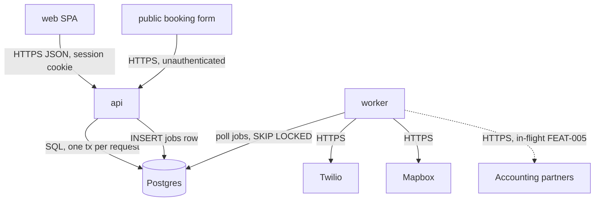

# Architecture

*Derived from `.mochiko/product/architecture/` — regenerated on every store write. Do not hand-edit.*
*Rendered 2026-06-30.*

## Spine

Boundaries, flows, and per-element status: `.mochiko/product/architecture/spine.md`.

## Concerns

| AX | Concern | Stance | Status | Summary | Detail |
|----|---------|--------|--------|---------|--------|
| AX-001 | Multi-tenancy | decided | built | pooled, `account_id` scoping through `store.Scoped` | `concerns.md` |
| AX-002 | Identity & auth | decided | built | email + password, account-scoped session cookie | `concerns.md` |
| AX-003 | Authorization | decided | built | two roles per account: dispatcher, technician | `concerns.md` |
| AX-004 | Background work | decided | built | `jobs` table polled by `worker`, idempotent handlers | `concerns.md` |
| AX-005 | Notifications | decided | built | customer SMS via Twilio from `worker`; dispatcher email | `concerns.md` |
| AX-006 | API surface | decided | in-flight (FEAT-005) | internal JSON API; outbound partner webhooks | `concerns.md` |
| AX-007 | Deployment & environments | decided | built | Fly.io, one app per env, two process groups | `concerns.md` |
| AX-008 | Billing & entitlements | not-now | ruled | hand-raised invoices until the 25th account | `concerns.md` |
| AX-009 | Data lifecycle | not-now | ruled | deferred pending the Q2 retention decision | `concerns.md` |
| AX-010 | Observability | open | ruled | walked 2026-06-24, no stance | `concerns.md` |
| AX-011 | Feature flags & rollout | open | ruled | walked 2026-06-24, no stance | `concerns.md` |

## Health

- **Open rows** — 2: AX-010, AX-011
- **Stale `not-now` triggers** — 0
- **Fired triggers awaiting routing** — 0
- **Orphan elements** — 0
- **Drift register** — 0
