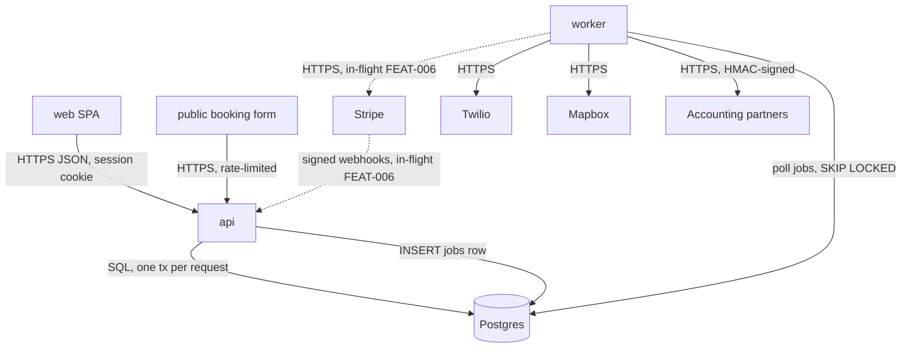

# Architecture Spine

**Scope**: backend-service

## Container diagram



## Elements

| ID | Kind | Name | Responsibility | Talks to (style) | Status |
|----|------|------|----------------|------------------|--------|
| SPN-001 | container | api | JSON routes, session auth, serves the SPA, runs migrations on boot; verifies inbound webhooks at the edge | SPN-003 (sync SQL, one tx per request); SPN-002 (a `jobs` row, never a call) | built |
| SPN-002 | container | worker | polls `jobs` every 5 s and runs one idempotent handler per kind | SPN-003 (SQL); Twilio, Mapbox, partners (sync HTTPS with retry) | built |
| SPN-003 | container | db | Fly Postgres 16, single node, daily snapshot; every tenant table carries `account_id` | — | built |
| SPN-004 | container | web | React SPA served by api | SPN-001 (HTTPS JSON) | built |
| SPN-005 | boundary | public edge | the unauthenticated surface: `/book/{slug}` behind `RateLimit`; `/webhooks/stripe` behind signature verification; everything else behind the session | — | built |
| SPN-006 | flow | Stripe webhook intake | api verifies the signature, records the event, enqueues a `stripe_event` row; worker fetches the subscription from Stripe and updates entitlements | Stripe → SPN-001 → SPN-003 → SPN-002 → Stripe | in-flight (FEAT-006) |
| SPN-007 | flow | job completed → partner webhook | worker posts a signed `job.completed` event to each partner endpoint, retried with backoff | SPN-002 → partners (sync HTTPS, HMAC-signed) | built |
| SPN-008 | boundary | tenant scope | `store.Scoped` is the only door to a tenant table | — | built |
| SPN-009 | flow | assign → ETA SMS | assign commits the job and a `send_eta_sms` row in one tx; worker sends within 30 s p95 | SPN-001 → SPN-003 → SPN-002 → Mapbox → Twilio | built |

## Key flows

```mermaid
sequenceDiagram
    participant S as Stripe
    participant A as api
    participant P as Postgres
    participant W as worker
    S->>A: POST /webhooks/stripe (signed)
    A->>A: verify signature
    A->>P: INSERT stripe_events; INSERT jobs(stripe_event)  (one tx)
    A-->>S: 200
    W->>P: claim (SKIP LOCKED)
    W->>S: GET /v1/subscriptions/{id}
    W->>P: UPSERT subscriptions; audit_events(plan_changed); jobs.done_at
```
