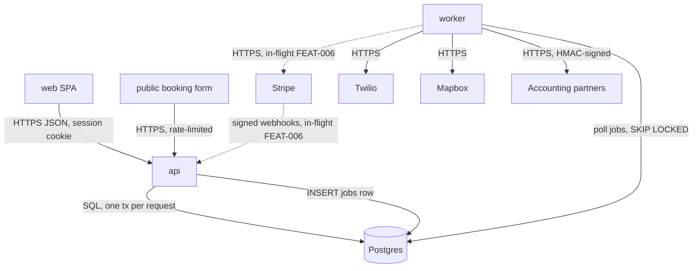

# Architecture

*Derived from `.mochiko/product/architecture/` — regenerated on every store write. Do not hand-edit.*
*Rendered 2026-08-24.*

## Spine

Boundaries, flows, and per-element status: `.mochiko/product/architecture/spine.md`.

## Concerns

| AX | Concern | Stance | Status | Summary | Detail |
|----|---------|--------|--------|---------|--------|
| AX-001 | Multi-tenancy | decided | built | pooled, `account_id` scoping through `store.Scoped` | `concerns.md` |
| AX-002 | Identity & auth | decided | built | email + password, account-scoped session cookie; SSO trigger fired 2026-08-20 | `concerns.md` |
| AX-003 | Authorization | decided | built | two roles per account | `concerns.md` |
| AX-004 | Background work | decided | built | `jobs` table polled by `worker`, idempotent handlers | `concerns.md` |
| AX-005 | Notifications | decided | built | customer SMS via Twilio from `worker` | `concerns.md` |
| AX-006 | API surface | decided | built | internal JSON API; outbound partner webhooks | `concerns.md` |
| AX-007 | Deployment & environments | decided | built | Fly.io, one app per env, two process groups | `concerns.md` |
| AX-008 | Billing & entitlements | decided | in-flight (FEAT-006) | Stripe subscriptions; webhook verified in `api`, processed in `worker` | `concerns.md` |
| AX-009 | Data lifecycle | not-now | ruled | export and deletion by account on the Northgate contract | `concerns.md` |
| AX-010 | Observability | decided | built | request id, Sentry, `jobs` backlog alert | `concerns.md` |
| AX-011 | Feature flags & rollout | not-now | ruled | per-account column for the next risky surface | `concerns.md` |
| AX-012 | Product analytics | n-a — handled elsewhere | ruled | owned by `fieldnote-growth` | `concerns.md` |
| AX-013 | Security baseline | decided | built | rate limit on the public edge, audit log on money-moving actions | `concerns.md` |

## Health

- **Open rows** — 0
- **Stale `not-now` triggers** — 0
- **Fired triggers awaiting routing** — 1: AX-002 (SSO, routed to `BACKLOG.md` Northgate item 2026-08-20; awaiting the feature desk)
- **Orphan elements** — 0
- **Drift register** — 0
