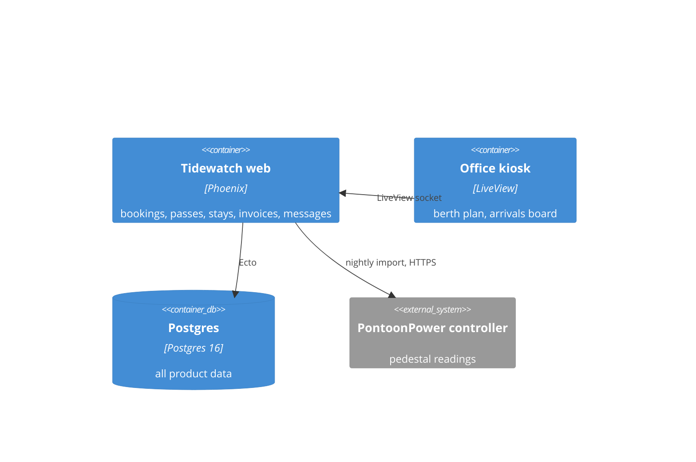
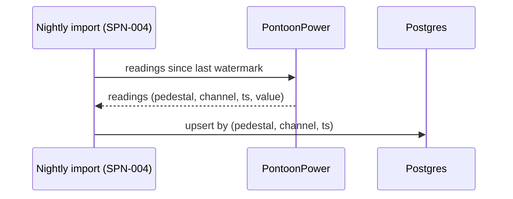

# Architecture Spine

Scope: backend-service + web kiosk (one harbour per deployment).

## Container diagram

## Elements

| ID | Kind | Name | Responsibility | Talks to | Status |
|----|------|------|----------------|----------|--------|
| SPN-001 | container | Tidewatch web (Phoenix) | bookings, passes, stays, invoicing, skipper messages | SPN-002 (Ecto), SPN-004 | built |
| SPN-002 | container | Postgres | all product data | — | built |
| SPN-003 | container | Office kiosk (LiveView) | berth plan and arrivals board on the office tablet | SPN-001 (socket) | built |
| SPN-004 | flow | Nightly pedestal import | pulls readings from the PontoonPower controller, idempotent | IP-001 (HTTPS) | built |
| SPN-005 | container | Pre-arrival form | the public pre-arrival page, off since June | SPN-001 | removing (FEAT-012) |

## Key flows

