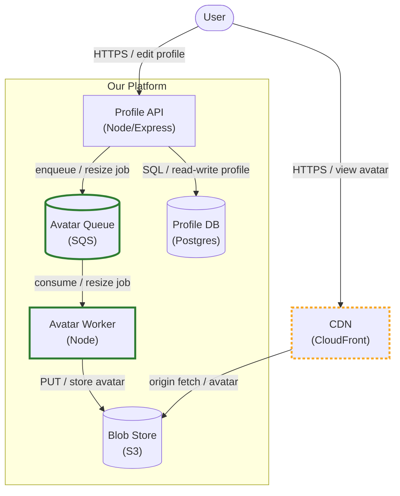
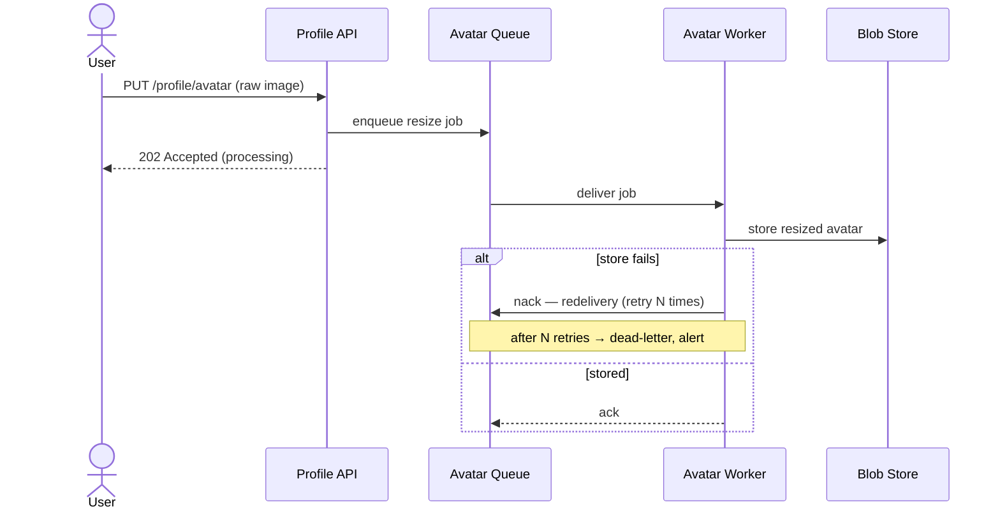
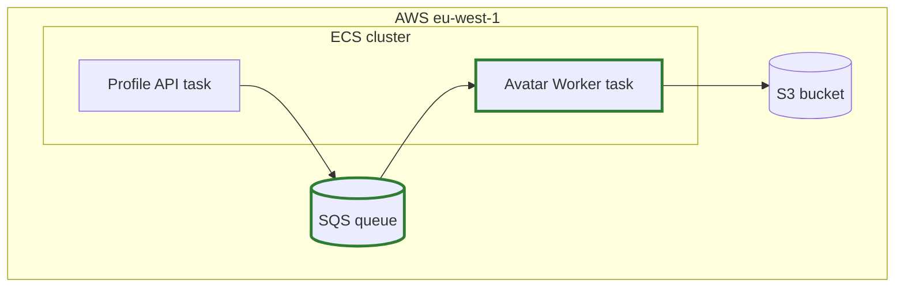

# Diagram Conventions

Copy-ready mermaid patterns for the `architecture.md` pieces. Two rules run through all of them:
**C4-as-method, flowchart-as-carrier** (mermaid's dedicated C4 syntax is experimental — use standard
`flowchart` / `sequenceDiagram` and apply C4 discipline by hand), and **the delta is visible**
(new/modified/removed read differently from unchanged at a glance).

---

## Container delta diagram

The sign-off surface: the target state at C4 **container** level, with the delta marked. Boundaries
are `subgraph` blocks, technology lives in the node label, and every arrow carries **protocol +
purpose**.

**Delta styling — the convention:**

| Status | Style | mermaid |
|--------|-------|---------|
| **new** | solid, thick, green stroke | `classDef new stroke:#2e7d32,stroke-width:3px;` + `:::new` on the node |
| **modified** | thick, amber, dashed stroke | `classDef modified stroke:#f9a825,stroke-width:3px,stroke-dasharray:4 3;` + `:::modified` |
| **removed** | struck / greyed, kept for one delta so the reader sees what left | label prefix `~~removed~~` (or `classDef removed stroke:#9e9e9e,color:#9e9e9e;`) |
| **existing** | default (no class) | plain node |

Node-shape hints (optional, aids reading): `["service"]` process, `[("store / queue")]` datastore or
queue, `(["actor"])` person/external actor, `{{"external system"}}` third-party. Don't over-encode —
the label + technology + delta styling carry the meaning; shapes are a light aid.

**Rendering:** the diagram must be valid mermaid that renders — it is presented as a *picture*, never
as a raw code block standing in for one. Keep node ids short and label text in quotes so protocol
slashes and ` ` render cleanly.

---

## Sequence diagram — one per qualifying flow

A **qualifying flow** crosses ≥2 components and has non-trivial ordering or failure semantics (a user
journey *or* a system flow). Show the ordering *and* the failure path — the failure path is usually
why the flow qualifies.

Use `alt` / `opt` / `Note` to make ordering and failure explicit. Participants are the same
components named in the container diagram and the component table — keep the names identical across
all three pieces.

---

## Deployment view — conditional

Author **only when the feature carries `IP-XXX` provisioning rows** (it changes deployment reality).
A flowchart with runtime/infra boundaries as subgraphs:

No `IP-XXX` rows → omit the section and record the omission in one line
(`no deployment change — no IP-XXX rows`).

---

## Scale bound in practice

When the delta neighborhood (changed components + direct collaborators) exceeds the box threshold
(**default ~12 rendered nodes**, overridable per project), do not inline the full system. Inline the
neighborhood; add one line linking the wider map
(`ARCHITECTURE.md`, or the prior feature's architecture) for everything unchanged. A no-delta feature
on a large system shows the touched neighborhood, not the whole estate.
